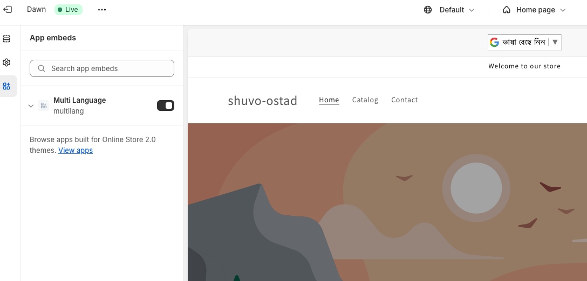

## Shopify Multi Language

### Install

- Clone this repository or download
- run <code>npm install</code>
- run <code>npm run dev</code>
  - Select Partners organization
  - Select or Create App
  - Select Specific store for run this app
- Navigate to Shopify admin, go to <strong>Online Store</strong> &gt; <a href="https://admin.shopify.com/themes"><strong>Themes</strong></a>.
- Find the theme that you want to edit, and then click <strong>Customize</strong>.
- On the sidebar, click the <strong>App embeds</strong> icon.
- Select the app embed that you want to activate or click the Search bar and enter a search term to search through your installed apps.
- Beside the app embed that you want to activate, click the toggle to activate it.
- Preview your store to view the embedded app live.

### Requirements
- Node <code>18.12.0</code>
- Ruby <code>2.7.5</code> or greater

### Screenshots

